关注NoSQL开发公众号，全面了解NoSQL开发相关知识

# NoSQL 概述

- NoSQL 概览
  1. RDBMS VS NoSQL
  2. NoSQL 种类
  3. NoSQL 的一些名词
- 结合Mongo,Cassandra谈谈NoSQL的设计和应用
   1. 部署架构
   2. 分片
   3. 数据存储与维护
   4. 读写分析
   5. 数据模型
- 总结

---

# 关系型数据库 VS NoSQL VS New SQL

关系型数据库：元组关系(ER)，提供了一套标准的接口，SQL

NoSQL: non-relational,Not-Only SQL,致力于解决关系型数据库扩展的问题

New SQL: 结合RDBMS 与NoSQL的优势(还没有看到一个清晰的概念定义)


---

## NoSQL 种类
数据模型|相关数据库|典型应用|优势|劣势|
----|:----:|----:|----:|----:|
key-value|Redis|缓存|快速查询|存储数据缺乏结构化
列族|Cassandra,Hbase|分布式的文件系统，大规模的数据存储|易于分布式扩展|功能受限
document|Mongo,CouchDB||free-schema|可扩展性查
图|Neo4J|社交网络|利用图结构相关算法|不易扩展

**key-value 结构**

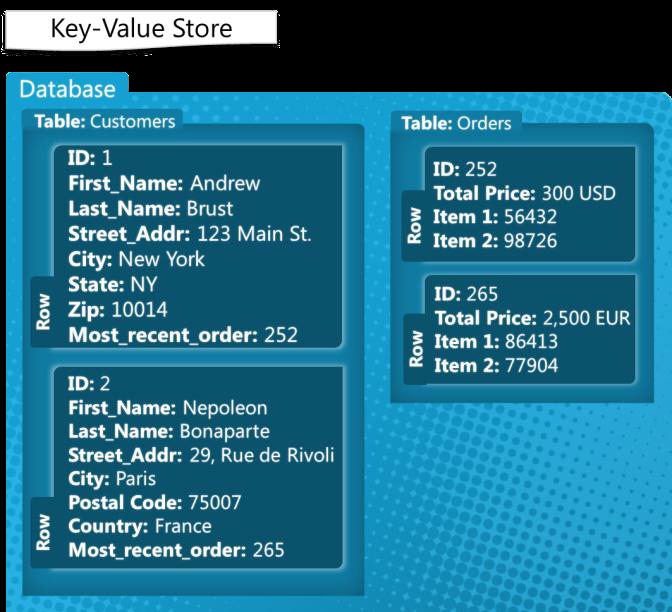

**wide-column(两级映射)**

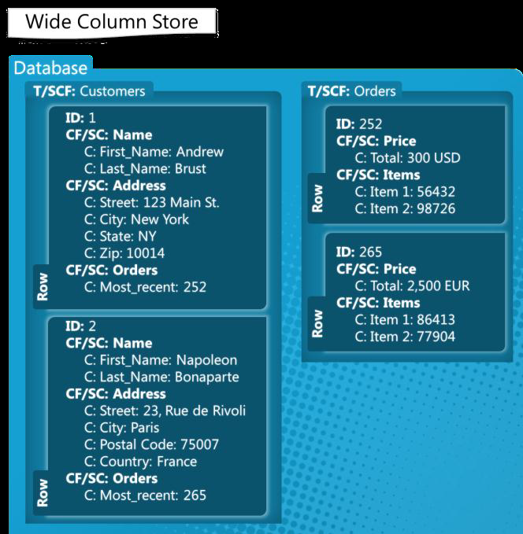

**document**

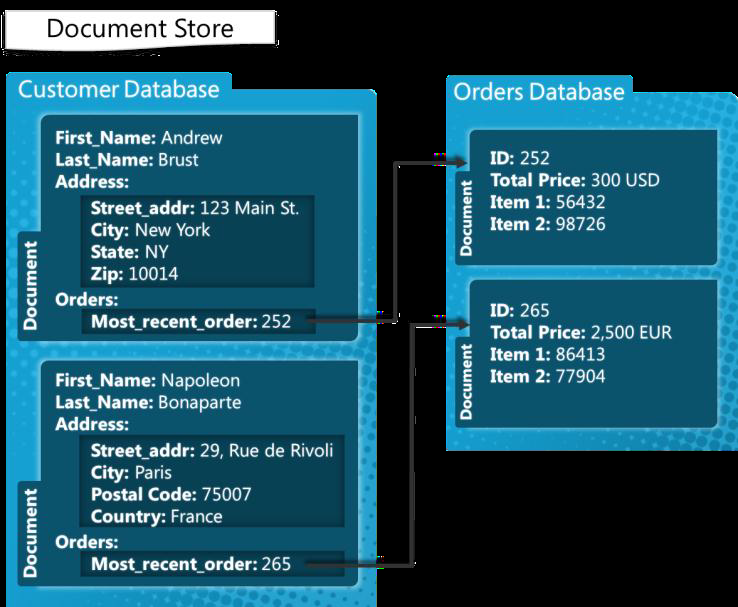

**mongo应用**

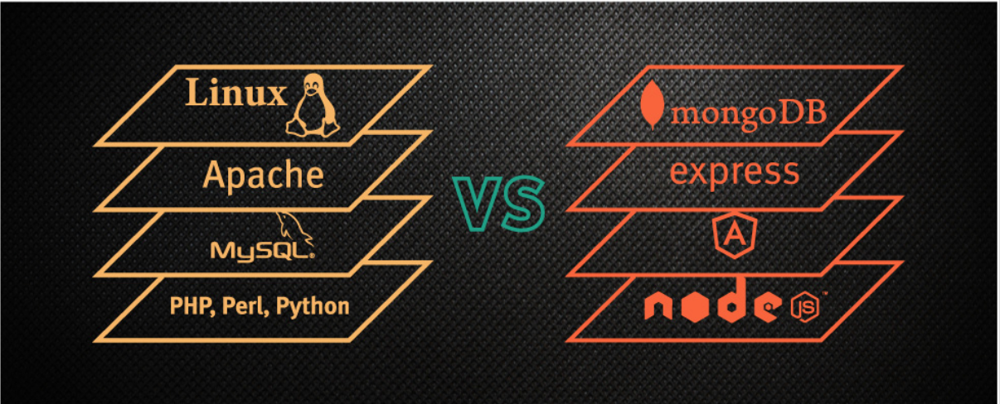

---
## NoSQL 主要概念
不支持事务和join

### BASE VS ACID

Basically Available  主要可用

Soft-State:  软状态,相比较硬状态，就是某个时间段，集群数据有可能会不一致

Eventually Consistency: 最终一致性

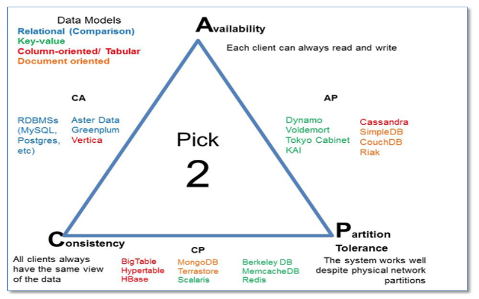


---
### 为什么介绍Cassandra和Mongo

**最新的数据库排名**
https://db-engines.com/en/ranking

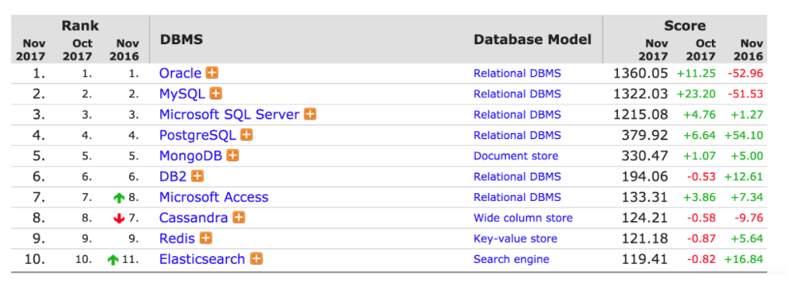

---
# 系统部署架构

围绕着高可用,易扩展来设计

RDBMS 主要是通过主从读写分离，分库分表来解决

## mongo

单个节点

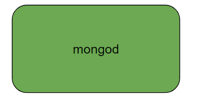

复制集(高可用)raft一致性协议

> 复制集架构模式还并不是一种分布式存储，只是实现了高可用，replicate set 与 master-slave还是不一样的


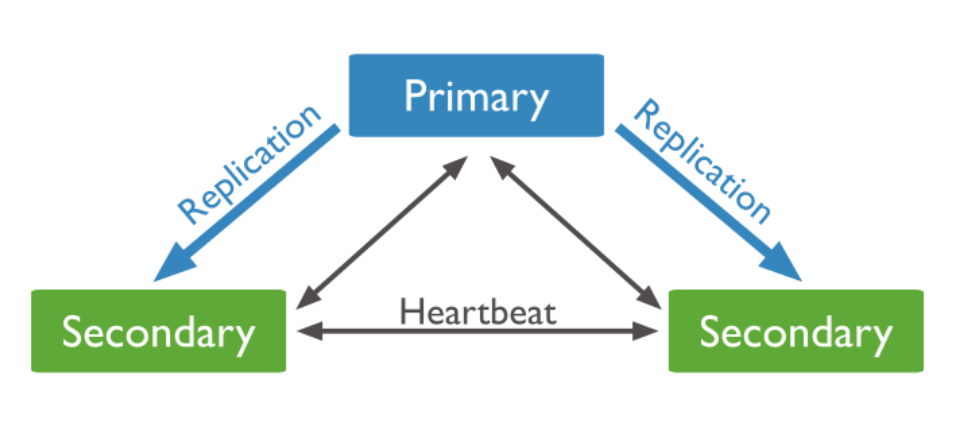

还有一种投票节点用于选举，不存储数据

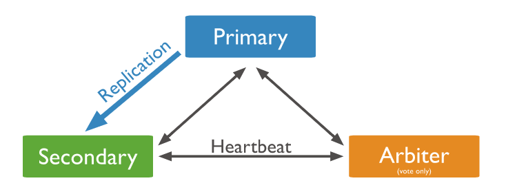

<<<<<<< HEAD
=======

>>>>>>> 076a2ab4142599431078f2d601fc77143da6745a

sharding(可扩展)

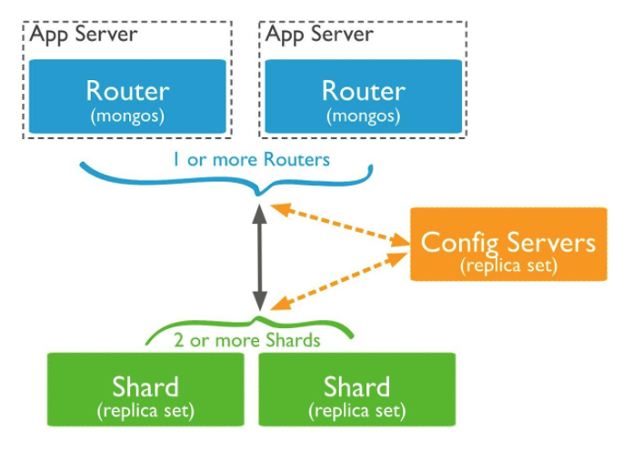

## Cassandra

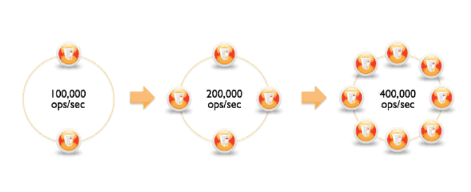

paxos(w+r>n)

---
# 分片

思考: 什么样的分片是合理高效的

## mongo

mongo 默认配置是不分片的，需要自行enable.mongo 根据shard key来对数据进行分片。有三种分片方式

- range
根据范围来分片，比如1-10到shardA,11-20 shardB，以此类推
range分片会让相近的数据分配在同一个shard上，这样如果进行shard key范围查找的时候效率更高，因为不需要跨shard，或者跨更少的shard.

- hash
根据shard key的hash 值来分片
会让数据分布的更加均匀，降低了某一部分连续的数据都存储在同一shard上，导致数据在集群中分布不均匀。

- tag
代表的shard key 的一段范围值,比如下图Tag A代表的就是[1,10)

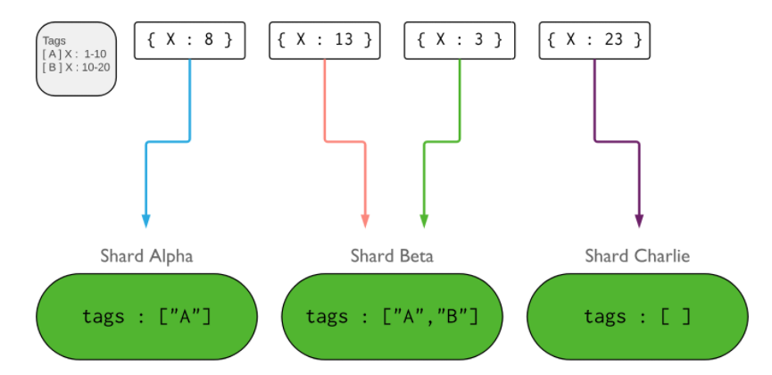

tag通常是用来隔离数据的，多用于多数据中心架构中。确保相近的数据能够落在物理上相近的shard上。

---

## Cassandra
一致性hash来分partition

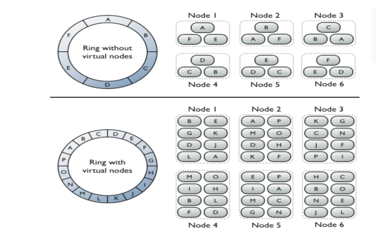


分片的原则就是
1. 数据尽可能的在节点中均匀分布,数据的balance
2. 避免热点插入,(虽然可以通过数据库本身的balance作用来解决存储问题，但是解决不了插入性能问题)

> 从严谨的角度来说，partition 叫分区，shard 叫分片两者存在一些区别。但从这边的数据分布
的角度去看的话，没有本质区别，Hbase还叫region呢

---
# 数据存储与维护

存储引擎结构：

| 类型 | 功能 | 应用 |
| ------------- |-------------| -----|
| hash | 增删改、随机读、~~顺序扫描~~ | Key-Value存储系统 |
| B-Tree | 增删改、随机读、顺序扫描 | 关系型数据库 |
| LSM | 增删改、随机读、顺序扫描 | 分布式存储系统，如cassandra、google LevelDB |


**LSM**

Log-Structured Merge Tree:结构化合并树，核心思想就是不将数据立即从内存中写入到磁盘，而是先保存在内存中，积累了一定量后再刷到磁盘中

### LSM VS B-Tree ###

LSM在B-Tree的基础上为了获取更好的写性能而牺牲了部分的读性能，同时利用其它的实现来弥补读性能，比如boom-filter.

1.写

B树的写入，是首先找到对应的块位置，然后将新数据插入。随着写入越来越多，为了维护B树结构，节点得分裂。这样插入数据的随机写概率就会增大，性能会减弱。

LSM 则是在内存中形成小的排好序的树，然后flush到磁盘的时候不断的做merge.因为写入都是内存写，不写磁盘，所以写会很高效。另外全是顺序写，没有随机写

2.读

B树从根节点开始二分查询直到叶子节点，每次读取一个节点，如果对应的页面不在内存中，则读取磁盘，缓存数据。

LSM树整个结构不是有序的，所以不知道数据在什么地方，需要从每个小的有序结构中做二分查询，找到了就返回，找不到就继续找下一个有序结构。所以说LSM牺牲了读性能。但是LSM之所以能够作为大规模数据存储系统在于读性能可以通过其他方式来提高，比如读取性能更多的依赖于内存/缓存命中率而不是磁盘读取。

##mongo

### MMAPv1 ###

Mongo 3.2以前默认使用MMAPv1存储引擎，是基于B-Tree类型的。

**边界(padding)**

MMAPv1 存储引擎使用一个叫做"记录分配"的过程来为document存储分配磁盘空间。MongoDB与Cassandra不同的是，需要去更新原有的document。如果原有的document空间不足，则需要将这个document移动到新的位置，更新对应的index。这样就会导致一些不必要的更新，和数据碎片。

为了避免出现上述情况，就有了边界的概念，就是为document预分配空间。但是这样就有可能造成资源的浪费。mongo 按照64M,128M,256M...2G的2的冥次方递增策略预分配，最大2G。在数据量小的情况下问题并不明显，但是当达到2G时，磁盘占用量大的问题就出来了。

同样这一点和关系型数据库也不一样，关系型数据库对于长记录数据会分开存储。

现在做成可插拔的了

**WiredTiger**

3.2及其以后的默认存储引擎,同样是基于B-Tree的。采用了lock-free,风险指针等并发技术，使得在多核机器上工作的更好。
锁级别为document。**并且引入了compression，减少了磁盘占用。**

> WireTiger本身也有LSM,B-Tree两种
另外现在mongo支持不同的存储引擎，如腾讯

http://www.mongoing.com/2017/04/24/mongodb-shenzhen-user-group

---
### 数据的balance-增删节点

**mongo**

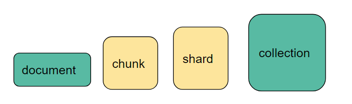

chunk 是一组shard key value的集合。他有大小限制，默认的chunk size 是64MB.你可以去更改这个值。当chunk超过这个值，插入或者更新时就会触发chunk 分裂，chunk代表更小范围的shard key value 集合。所以chunk最小范围是一个shard key,以后再也无法分裂。当chunk 在各个shard 上分布不均匀的时候，mongo 的balancer就会move chunk,确保在chunk在各个shard中均匀分布。moveChunk是需要代价的，所以mongo有阈值来控制什么时候去move chunk.

| chunk数量 | 阈值 |
| ------------- |-------------|
| <20| 2 |
|20-79|4|
|>=80|8|

当一个chunk document 数目超过250,000 或者大小超过1.3*(chunk_size/obj_avg_size)的时候就无法move了。obj_avg_size是一个document的平均大小。就会演变成一个超级大的chunk，就会导致数据的分布不均匀，导致请求的热点产生，极大的影响性能。这是我们不想看到的。所以通常来说单一字段作为shard key，都会造成问题，需要联合字段来做shard key.

**cassandra**

节点负责的partionkey发生变化，因为有虚拟节点的存在,每个已有的节点需要移动的数据就会很少

---
# 客户端交互-读写分析

**mongo**

- sharding模式，client端配置router节点

- replicat模式，client端配置复制集节点

write:
副本策略有复制集决定，所以不同的表都是一样。写也是写到主节点，然后通过oplog复制到从节点

读：

Read Preference
- primary:只从primary node读取
- primaryPreferred:先从primary node读取，但是如果secondary节点不可达，则查询primaryPreferred
- Secondary:只从secondary读
- secondaryPreferred: 先从secondary node上读取，如果不可达，则从primary node读取。
- nearest: 从最近的节点读取，在多个datacenter 可能会比较有用

> 从secondary节点读取的数据有可能是过时的数据

**cassandra**

应用端发起的

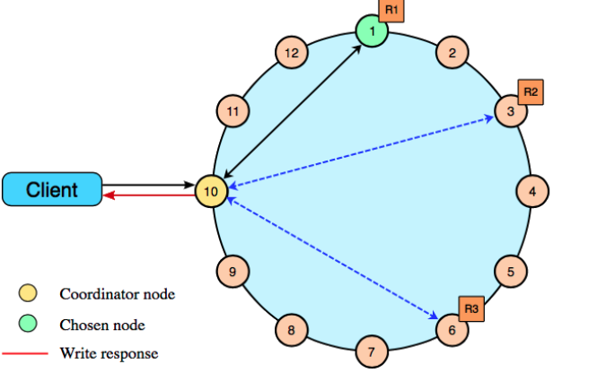

---
单个节点写

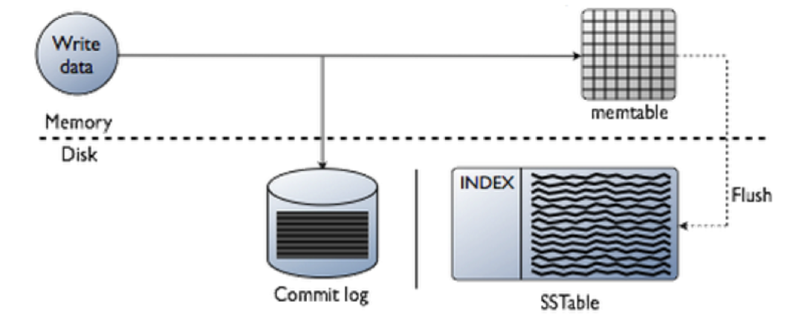

单个节点读

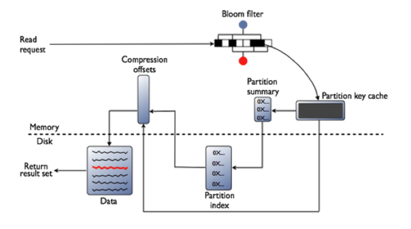

- 检查 memtable如果enabled了,检查row cache
- 检查Bloom filter 如果enable了,检查partition key 缓存
- 如果在partition key缓存中找到了partition key,直接去compression offset mao中，如果没有，检查 partition summary
- 根据compression offset map找到数据位置从磁盘的SSTable中取出数据

LSM树整个结构不是有序的，所以不知道数据在什么地方，需要从每个小的有序结构中做二分查询。效率不高，所以缓存来凑

# 数据模型

范式(数据不要冗余)与反范式


---

-  解决多表关联问题


- 不需要的字段可以不存

  比如优惠券

```
    private Integer type;
    private Integer range;
    private Float discountValue;
    private Integer discountPercent;
    private Float minOrderValue;
    private Date activeDate;
    private Date expireDate;
    private Integer validDay;
    private Integer total;
    private Integer limit;

```

>cassandra 需要提前考虑分片，这样就不会出现随着数据量的增加，进行水平扩展时，更改应用端
的查询模式，mongo 在这一点上很坑


---
### 索引

**mongo**

mongo 的索引基于B+ tree，与关系型数据库很类似
对于scalar(标量字段) 和关系型数据库就很类似

同样可以在非标量字段(array,embeded document)上建立索引如array上创建多键索引

[一个例子](https://yq.aliyun.com/articles/74635)

**cassandra**

cassandra 的索引与通常意义上的索引有很大的区别。
cassandra 的索引是新创建一张表，local index

http://blog.csdn.net/FS1360472174/article/details/52733434
---
# 总结

## NoSQL vs 关系型数据库

1. 关系型数据库提供了一套标准的SQL接口，学习成本比较低，而不同的NoSQL查询不一样，
学习成本高，另外做数据处理，很容易成为瓶颈

2. 目前的NoSQL不仅需要取数据，还需要关注数据如何存储，才能获取比较好的读写性能,应用领域相对较窄

3. NoSQL 的schema比较灵活，数据模型的设计比较快，加速了开发。


Cassandra VS mongo

---
- license
mongo 是AGPLV3,mongo driver 才是apache.AGPLV3不是完全开源的，
cassandra 是apache,无压力

- 性能
现在这世道，是个数据库都说自己是高性能。个人使用情况来看。cassandra写入性能要好很多，原因在于他只写commit log 和memtable.线性扩展Cassandra也好很多。读操作没有特别区别。
但是不基于业务来谈性能没什么多大意义。因为cassandra为了高效存储数据，对query的支持不是很友好，所以通常为了满足query，你可能需要建立index,视图，或者新表。这些开销会影响到写性能。

- 数据模型
mongo 支持复杂的数据模型，数据类型更加的丰富，还可以嵌套文档。
cassandra 相对要弱点。

- 集群架构
mongo 的sharding 集群需要三种角色，query router,config server,data store replicat set.当有primary节点down掉，需要重新选举primary node.所以会有down time.另外集群角色多，部署起来相对麻烦，但个人觉得这不是什么多大问题，毕竟没有人需要经常去部署。
cassandra所有节点都一样，replication_factor 为3的，write_consistency 为quorum时，可支持1个node down。对于整个cluster来说，是zero down time.没有任何影响。

- multi active-active 数据中心
mongo 有主从节点，只有主节点能够写。所以没法做到active-active.如果用户从一个数据中心到另外一个数据中心了，没法写到新的数据中心，必须要写到最初的数据中心。
cassandra 没问题，server端可以配置DC-Aware 模式，就可以根据server来路由到新的数据中心

- 与关系型数据库对比
mongo 更像关系型数据库，虽然mongo是基于document，没有了SQL语句，而cassandra却有CQL.以及mongo 没有Schema，而cassandra却有。


# 参考
https://en.wikipedia.org/wiki/MEAN

http://www.infoq.com/cn/news/2017/10/SQL-NoSQL-mean-what

http://www.mongoing.com/wp-content/uploads/2016/05/Raft%20Consensus%20in%20MongoDB%20-%20Chinese.pdf

http://www.mongoing.com/wp-content/uploads/2016/05/Raft%20Consensus%20in%20MongoDB%20-%20Chinese.pdf

http://usblogs.pwc.com/emerging-technology/how-nosql-key-value-and-wide-column-stores-make-in-image-advertising-possible/

https://github.com/wiredtiger/wiredtiger/wiki/Btree-vs-LSM
